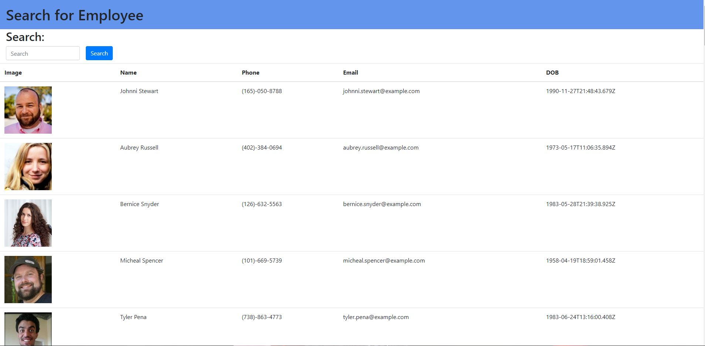

# User-Directory

## Description 
See a list of users and sort them by name

  
## Table of Contents

* [Installation](#installation)
* [Usage](#usage)
* [Credits](#credits)
* [Contributing](#contributing)
* [Tests](#tests)

## Installation
App is deployed at https://babydylan.github.io/user-directory

## Usage
Enter the name you want to search into the search bar

## Contributing
ReactJs

## License
ISC License (ISC)

## Questions
If you have any questions you can reach me at babydylan or babydylannguyen@gmail.com